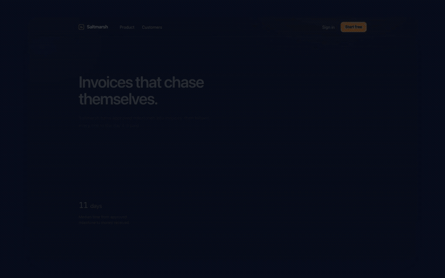

<div align="center">

<pre>
 ██████╗ ███████╗███╗   ███╗ ██████╗
 ██╔══██╗██╔════╝████╗ ████║██╔═══██╗
 ██║  ██║█████╗  ██╔████╔██║██║   ██║
 ██║  ██║██╔══╝  ██║╚██╔╝██║██║   ██║
 ██████╔╝███████╗██║ ╚═╝ ██║╚██████╔╝
 ╚═════╝ ╚══════╝╚═╝     ╚═╝ ╚═════╝
 ███╗   ███╗ ██████╗ ████████╗██╗ ██████╗ ███╗   ██╗
 ████╗ ████║██╔═══██╗╚══██╔══╝██║██╔═══██╗████╗  ██║
 ██╔████╔██║██║   ██║   ██║   ██║██║   ██║██╔██╗ ██║
 ██║╚██╔╝██║██║   ██║   ██║   ██║██║   ██║██║╚██╗██║
 ██║ ╚═╝ ██║╚██████╔╝   ██║   ██║╚██████╔╝██║ ╚████║
 ╚═╝     ╚═╝ ╚═════╝    ╚═╝   ╚═╝ ╚═════╝ ╚═╝  ╚═══╝
</pre>

### The AI agent makes the demo video. All of it.

**One prompt in. A finished `.mp4` out. No human in the edit.**

[](./LICENSE)
[](https://modelcontextprotocol.io)
[](https://www.typescriptlang.org/)
[](./CONTRIBUTING.md)

<br>



<sub><b>This clip was not edited by a human.</b> An agent opened the app, scrolled it, filled the signup form, submitted it, and the pipeline produced the zooms, the cursor, the captions and the cuts. <a href="./docs/assets/demo.mp4">Full quality MP4</a> · <a href="./fixtures/showcase-app">the app in the clip</a> ships with the repo, so you can reproduce this.</sub>

</div>

---

DemoMotion is a **Model Context Protocol (MCP) server** that turns an AI agent into a motion designer. The agent drives your web app, records the session as a frame-indexed timeline, decides where to zoom, cuts the dead time, and renders a polished product-demo video — programmatically. There is no timeline to drag and no human in the edit.

It exists to collapse this:

```
brief → human records → human edits in a video editor → export
```

into this:

```
"Show how to add a client in my SaaS in 30 seconds."
        ↓  (one MCP call)
   product-demo.mp4
```

## Why this is not just another screen recorder

Loom, Screen Studio and Recordly are built for a **human** to record and edit. DemoMotion is built for an **agent** to operate the product and author the edit as data. The difference is who is driving — and that everything the agent decides is structured, inspectable, and reproducible.

The core principle: **capture what happened once; decide how it should look later.** The raw recording and the interaction events are the source of truth. Every creative choice — zoom, framing, cuts, speed, callouts — lives in a `project.json` the agent edits and re-renders, never baked into the pixels.

|                       | Loom · Screen Studio · Recordly | **DemoMotion**                     |
| --------------------- | ------------------------------- | ---------------------------------- |
| Who operates the app  | a human                         | **the AI agent**                   |
| Who makes the edit    | a human, in a UI                | **the agent, as `project.json`**   |
| Zoom / framing        | manual or heuristic on record   | **from real UI coordinates, editable after the fact** |
| Reproducible          | no                              | **yes — same input, same video**   |
| Interface             | a desktop app                   | **an MCP tool surface**            |
| License               | proprietary                     | **MIT**                            |

## How it works

```
 prompt
   │
   ▼
 AI agent ──(MCP tools)──► DemoMotion server
                               │
        ┌──────────────────────┼───────────────────────┐
        ▼                      ▼                        ▼
  deterministic          structured event         project compiler
  screen capture   ───►  timeline (sourceMs)  ───► project.json (editable)
  (CDP screencast,                                      │
   constant fps)                                        ▼
                                                 HyperFrames compositor
                                                  (camera · cuts · overlays)
                                                        │
                                                        ▼
                                                   final .mp4
```

Two design decisions do the heavy lifting:

- **The capture timeline is exact by construction.** Frames are laid on a constant-fps grid from CDP screencast timestamps, so `frame i ⇔ sourceMs = i / fps × 1000`. Events and frames share one clock — no guessing where a click landed by analysing the video afterward.
- **One time model for every edit.** Cuts and speed ramps collapse into a single `EditList` of `{sourceFromMs, sourceToMs, speed}` segments. Zooms and callouts are anchored to *when they happened*, then projected onto output time — so cutting a boring stretch repositions everything after it automatically.

## Quick start

Requires **Node.js 22+** and **pnpm 10**.

```bash
pnpm install
pnpm --filter @demomotion/mcp-server exec playwright install chromium
pnpm typecheck && pnpm test && pnpm build
```

> The Playwright install **must** be scoped with `--filter`. Playwright is a dependency of `apps/mcp-server`, not the workspace root; a bare `pnpm exec playwright ...` can fall through to an unrelated Playwright on `PATH` and provision the wrong browser cache.

Point your MCP client at the `tsx` entry directly (not `pnpm dev:mcp` — pnpm prints a banner on stdout, and an MCP stdio transport needs stdout to carry JSON-RPC only):

```json
{
  "mcpServers": {
    "demomotion": {
      "command": "/abs/path/demomotion-mcp/apps/mcp-server/node_modules/.bin/tsx",
      "args": ["/abs/path/demomotion-mcp/apps/mcp-server/src/index.ts"],
      "cwd": "/abs/path/demomotion-mcp",
      "env": { "DEMOMOTION_ALLOWED_HOSTS": "localhost,127.0.0.1" }
    }
  }
}
```

On a host where Playwright has no bundled Chromium build (e.g. macOS 13), drive a locally installed browser instead — no downgrade, no download:

```bash
DEMOMOTION_BROWSER_CHANNEL=chrome pnpm dev:mcp
```

## The MCP tool surface

The agent sees granular, auditable tools — not a black box — so any run can be debugged, retried or partially re-rendered.

| Tool | Purpose |
|---|---|
| `session_start` | Start a deterministic recording session |
| `browser_goto` / `browser_click` / `browser_fill` | Operate the product; clicks record normalized target coordinates, fills are redacted from metadata |
| `browser_scroll` / `browser_keypress` / `browser_wait` | Scroll, keyboard, intentional pacing |
| `browser_inspect` | Compact inventory of interactive elements with stable selectors |
| `browser_screenshot` / `session_status` | Diagnostic checkpoints |
| `session_stop` | Persist the recording + capture manifest (constant fps) |
| `project_build` | Compile a capture into an editable project + auto-zoom regions |
| `project_update` | Edit style, zooms, the edit list (cuts + speed ramps) and callouts — no re-recording |
| `render_video` | Render the final H.264 MP4 |
| `demo_finalize` | Stop → compile → render in one call |

An agent skill in [`skills/demomotion/SKILL.md`](./skills/demomotion/SKILL.md) tells the model *how* to use them: objective analysis, scene planning, capture, editing heuristics, render, validation.

## What works today, and what's next

DemoMotion is early and honest about it. Everything below the line is proven by execution in the test suite; everything in **Roadmap** is not built yet.

**Working and tested**
- Deterministic CDP screencast capture on a constant-fps grid (frame↔time exact by construction)
- Structured event timeline with normalized interaction coordinates
- `EditList`: cuts and constant-speed ramps in one model
- Camera / zoom with real easing, correct aspect ratio (no silent crop), held final frame
- **Synthetic cursor layer** — smoothed approach, click pulse, constant size under zoom
- **Word-by-word captions** with a restrained karaoke highlight, auto-seeded from action labels
- **Transitions** — crossfade at every cut, plus opening and closing fades
- Timed callouts anchored in source time
- Real H.264 MP4 render via the [HyperFrames](https://github.com/heygen-com/hyperframes) compositor
- Render telemetry **off by default** (see below)

Every layer above — zoom, cursor, captions, callouts — is anchored to *when it happened* and projected through the edit list. Cut a boring stretch and all of them follow; anything whose source instant was cut simply does not appear.

**Roadmap**
- Voiceover (TTS). The caption schema already stores per-word timings, so real audio alignment drops in without touching the compositor.
- Automatic scene detection and pacing — deciding *where* to cut (the `EditList` can already express it)
- VLM-based visual validation of the rendered output
- Native desktop capture behind the same tool surface

**Known limitations**
- A crossfade shows ~180 ms of adjacent cut material under a partly transparent clip — that is what an NLE handle is. Set `cutTransitionMs: 0` for hard cuts.
- Cutting *inside* a caption drops the words after the cut; place cuts between captions.

## Determinism, security & telemetry

- **Reproducible renders.** The same `project.json` produces a byte-identical MP4. `project.json` is the single source of truth — nothing travels as an unvalidated CLI variable.
- **Host allowlist.** Set `DEMOMOTION_ALLOWED_HOSTS` to restrict navigation. Only `http`/`https` are accepted.
- **Redaction.** Values sent through `browser_fill` are stripped from `capture.json`. (A target app may still *display* them on screen — use seeded demo data and dedicated accounts.)
- **No phoning home.** HyperFrames sends anonymous render telemetry to its vendor. Because DemoMotion renders on its users' behalf, it sets `HYPERFRAMES_NO_TELEMETRY=1` in the render process by default. Set the variable yourself (to any value) and DemoMotion keeps your choice.

See [`.env.example`](./.env.example) for every supported variable, and [`docs/ARCHITECTURE.md`](./docs/ARCHITECTURE.md) for the full design.

## Repository layout

```text
apps/mcp-server/     MCP control plane + deterministic capture + render driver
packages/compositor/ project.json → HyperFrames HTML (pure, no I/O)
packages/core/       editing heuristics + the sourceMs ⇄ outputMs bridge (EditList)
packages/schema/     shared project/action schemas (Zod)
skills/demomotion/   the agent workflow skill
```

## Contributing

Issues and PRs are welcome. The test discipline is strict on purpose: every behaviour is proven by a test that was seen to fail first, and both halves of a guarantee are asserted (the abuse is rejected **and** the legitimate case still passes). See [`CONTRIBUTING.md`](./CONTRIBUTING.md).

## License

DemoMotion source: **MIT**. The HyperFrames compositor on the render path is Apache-2.0. Both are permissive — DemoMotion adds no per-seat cost for the teams that adopt it.
